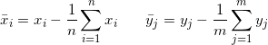
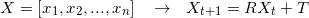

# CUDA Iterative Closest Point

**University of Pennsylvania, CIS 565: GPU Programming and Architecture,
Project 4 - CUDA Iterative Closest Point**

* Klayton Wittler
    * [LinkedIn](https://www.linkedin.com/in/klayton-wittler/)
* Tested on: Windows 10 Pro, i7-7700K @ 4.20GHz 16.0GB, GTX 1070 8.192GB (my PC)

## Sections
* [Introduction](#introduction)
    * [Algorithm](#algorithm)
    * [Optimizations](#optmizations)
* [Performance Analaysis](#performance-analysis)
* [Running](#running)
* [Bloopers](#bloopers)
* [References](#references)


*Note: Since the first step of the algorithm mean centers the scans, the translational difference cannot be seen. However it is still being solved for.*

## Introduction
This project implements point cloud scan matching via the iterative closeset point (ICP) algorithm. Three ways of executing the algorithm are compared: sequential CPU, paralelzation on GPU, and KD tree search on GPU.

### Algorithm
The algorithm has 5 steps:

1. Mean center both scans

    

1. Find correspondences for each point (closest point)
```
X = [x1,x2,..., xn]
Y = [y1,y2,....,ym]
correspondence = []

for i, xi in X
    bestDist = inf
    bestIndex = null
    for j, yj in Y:
        dist = distance(xi,yj)
        if dist < bestDist
            bestDist = dist
            bestIndex = j
            end if
    end for
    correspondence[i] = j
end for
```

1. Solve for the rotation and translation that matches correspondences ([Procrutes](https://en.wikipedia.org/wiki/Orthogonal_Procrustes_problem))

    

1. Transform source points

    

1. Repeat until convergence

The thing that makes this algorithm difficult is that the correspondences are not known which it why the above process must be iterated over. If the correspondence were known then a one iteration [Procrutes](https://en.wikipedia.org/wiki/Orthogonal_Procrustes_problem) algorithm would work.

### Optimizations
The most expensive operation in the algorithm is finding the correspondes for each point. In the CPU version of this algorithm everything is done sequential leading to an O(NM) time complexity. However, there is no reason why each points correspondence can't be found simultaneously. This is where we can leverage the capabilities of the GPU in getting rid of the outer for loop, reducing time complexity to O(M). Further optimizations utilizing spatial data structures can get time complexity to O(log M), where this project implements a KD tree spatial data structure.

#### KD Tree
A KD tree is a binary search tree in which every leaf node is a k-dimensional point and ever non-leaf node can be thought of as a split plane that divides the space into 2. If the split plane is 'x' for example then every value in the left subtree has a smaller 'x' values and the right subtree will have larger 'x' values. The split plane changes in a round robin fasion in each incrementing depth (x-y-z-x). To construct the tree, the points are sorted by the split plane at a given depth and the median is chosen as the next node. This can be recursively done until all points have been added to the tree. To traverse the tree, any traversal algorithm will work but must be iterative on the GPU. This project implements depth first search to find the correspondence.

   

## Performance Analysis
To do a performance analysis a timer is used for each iteration and recorded, in which the average time for iteration can be computed until convergence. All test were done on the [Stanford bunny](http://graphics.stanford.edu/data/3Dscanrep/) which consist of approximately 40,000 points. Below shows the optimization of thread count for the GPU algorithms. The naive approach has the best performance at 512 threads per block and although the KD tree has little variance in its performance with respect to thread count it also has a minimum at 512 threads.


Given the optimal thread count on the GPU we can compare to the CPU performance and see how much performance gain is gain by each improvement.

Method | Average iteration time (s) | Performance gain
:-------------------------:|:-------------------------:|:-------------------------:
CPU| 4.548 | -
Naive GPU | 0.02267 | 200
KD tree GPU | 0.00208 | 10

We have 200 times the performance gain in doing the naive GPU implementation and a further 10 times performance gain in utilizing a spatial data structure.

## Running
 A benefit of this implementation is that the scans to not need to be exactly the same. This can be seen in the differences between the ```bunny045.txt``` and the ```bunny045_removed.txt``` where 5% of the data points have been removed at random. These will load by default unless other arguements are given. Two separate scan may be given or a signle scan can be given and the program with give one a set rotation and translation. All scans are in the ```./data``` folder where there are a couple test scans that consist of simple sine waves to help step through the algorithms and debug.


## Bloopers
Initialization too far | Integer-Float rounding | SVD and outer product
:-------------------------:|:-------------------------:|:-------------------------:
| | 

* Initializatoin too far: Becuse ICP is not garanteed to converge to the global minimum we can sometime get interesting alignments if the starting scan is too far off
    * Here the removed data points can be seen as the empty parts in the green bunny
* Integer-Float rounding: This was caused by integer rounding when the variable should have been a float
* SVD and outer product: GLM matrices are column major so the outer product and subsequent SVD were incorrect

## References
* [KD tree](https://en.wikipedia.org/wiki/K-d_tree)
    * [Jeremy Newlin](https://github.com/jeremynewlin/Accel) implementation of KD tree used as reference
* [ICP](https://en.wikipedia.org/wiki/Iterative_closest_point)
    * [Lecture notes](https://cs.gmu.edu/~kosecka/cs685/cs685-icp.pdf)
* [Eric Jang's](https://github.com/ericjang/svd3) SVD for 3x3 matrices
* [Stanford Bunny](http://graphics.stanford.edu/data/3Dscanrep/)
* [Taylor Nelms](https://github.com/taylornelms15/Project1-CUDA-Flocking/blob/master/GRAPHING.md) timing code